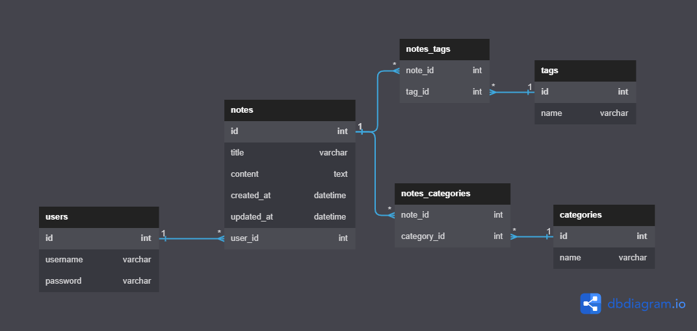

# projectNotes
 Autorzy: 
   - Szymon Frączek, szymonfr@student.agh.edu.pl 
   - Adrian Krupa, adkrupa@student.agh.edu.pl

### Schemat bazy danych:

### Opis aplikacji:
Nasza aplikacja funkcjonująca pod roboczym tytułem "projectNotes" umożliwia użytkownikom tworzenie, edytowanie i efektywne zarządzanie notatkami w celu zachowania ich organizacji i dostępności. Oto główne funkcje i aspekty tej aplikacji:

Tworzenie notatek: Aplikacja umożliwia tworzenie nowych notatek, w których użytkownicy mogą rejestrować ważne informacje, przemyślenia, zadania do wykonania oraz inne istotne dane wymagające zapisania.

Kategoryzacja notatek: Aby ułatwić organizację notatek, aplikacja zapewnia możliwość przypisywania ich do różnych kategorii. Użytkownicy mogą definiować i przypisywać notatki do kategorii zgodnie z ich tematyką, projektami lub dowolnym innym kluczem organizacyjnym.

Przypisywanie etykiet: Aby jeszcze bardziej sprecyzować i identyfikować notatki, użytkownicy mogą przypisywać im etykiety. Etykiety mogą zawierać słowa kluczowe, oznaczenia priorytetów lub inne znaczniki ułatwiające porządkowanie notatek.

Filtrowanie i sortowanie: Aplikacja umożliwia filtrowanie notatek na podstawie kategori i etykiet, Ponadto, użytkownicy mają możliwość sortowania notatek według daty ostatniej modyfikacji, tytułu lub kategorii, co ułatwia odnalezienie potrzebnych informacji.

W aplikacji istnieje funkcja rejestracji oraz logowania aby każdy użytkownik miał dostęp do swoich personalnych notatek, hasła użytkowników są zapisywane w formie skrótu(hashu) który skutecznie zabezpiecza ich dane.

